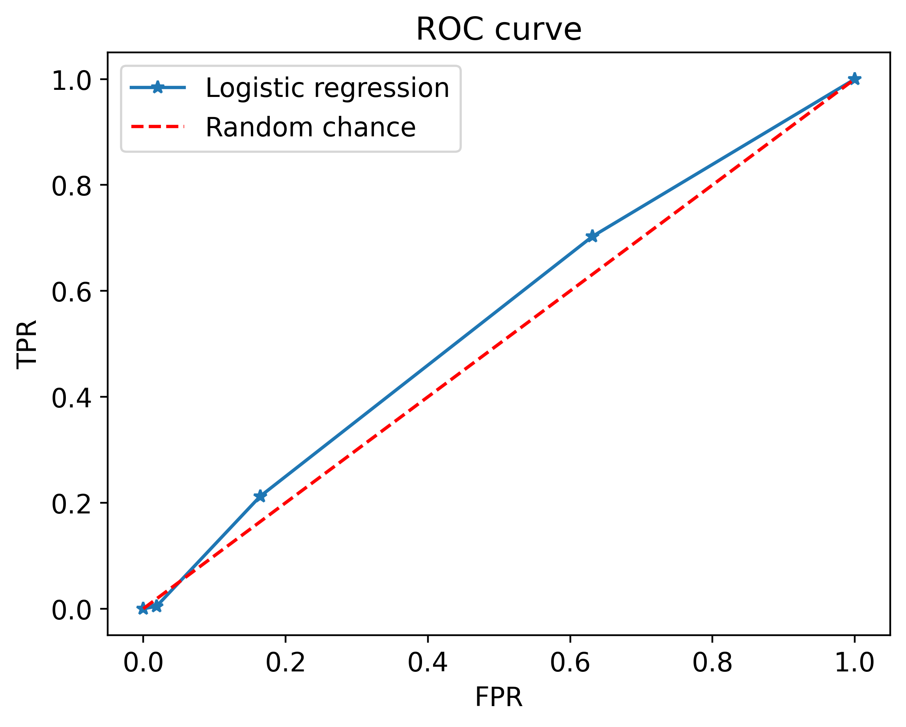
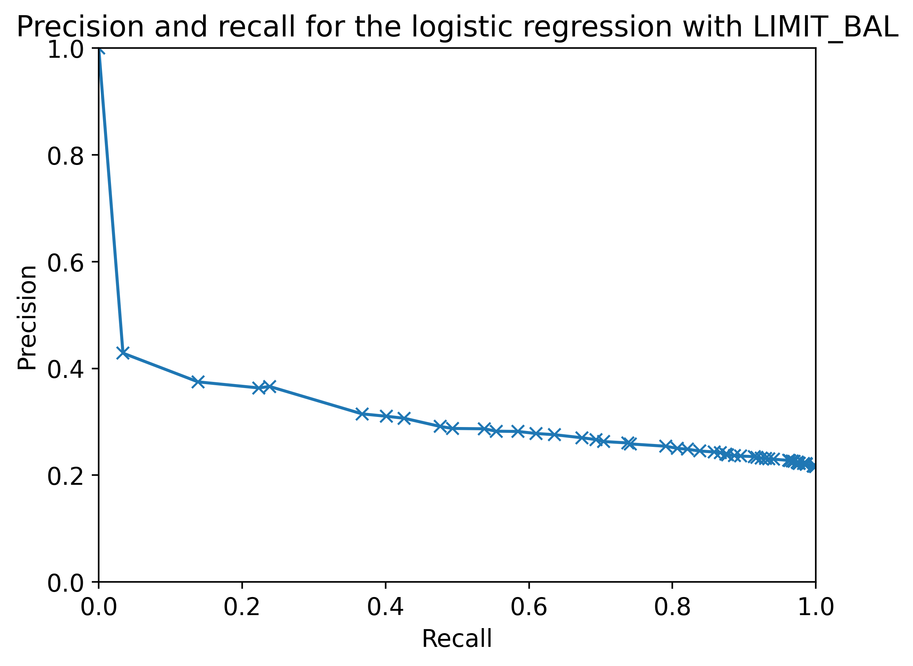

# Projeto 2 — Regressão Logística Univariada

Modelos de regressão logística treinados **uma característica por vez** para classificar inadimplência em cartões de crédito, com avaliação rigorosa via curvas ROC/AUC e precisão-recall.

**Fonte do projeto:** livro *Projetos de Ciência de Dados com Python* — Stephen Klosterman (Novatec Editora, 2020), Lição 2.

## Metodologia

1. **Dados:** UCI Credit Card (5.333 registros, 23 variáveis), split de treino/teste.
2. **Modelo:** `LogisticRegression` treinado separadamente para cada uma das 22 variáveis candidatas.
3. **Avaliação:**
   - Curva ROC (FPR × TPR) para cada modelo univariado;
   - AUC (área sob a curva ROC) como métrica agregada;
   - Curva precisão × recall para decidir ponto de corte.
4. **Baseline:** modelo aleatório (AUC ≈ 0.5; obtido 0.316 por inversão) para referência.

## Resultados

- Melhor variável isolada: **AUC = 0.618** — muito acima do baseline aleatório (0.316), confirmando sinal real em uma única característica.
- Nenhuma variável isolada é suficiente para um modelo forte — motiva a abordagem multivariada do Projeto 3.





## Estrutura do repositório

| Caminho | Conteúdo |
|---|---|
| `regressao_logistica_univariada.ipynb` | Notebook completo, já executado |
| `Data/` | Datasets do projeto (UCI Credit Card) |
| `img/` | Figuras extraídas do notebook |

## Como executar

```bash
pip install pandas numpy matplotlib seaborn scikit-learn xlrd
jupyter notebook regressao_logistica_univariada.ipynb
```

## Dependências

`pandas 1.5.3`, `numpy 1.24.4`, `scikit-learn 1.3.2`, `matplotlib 3.7.5`, `seaborn 0.13.2`
